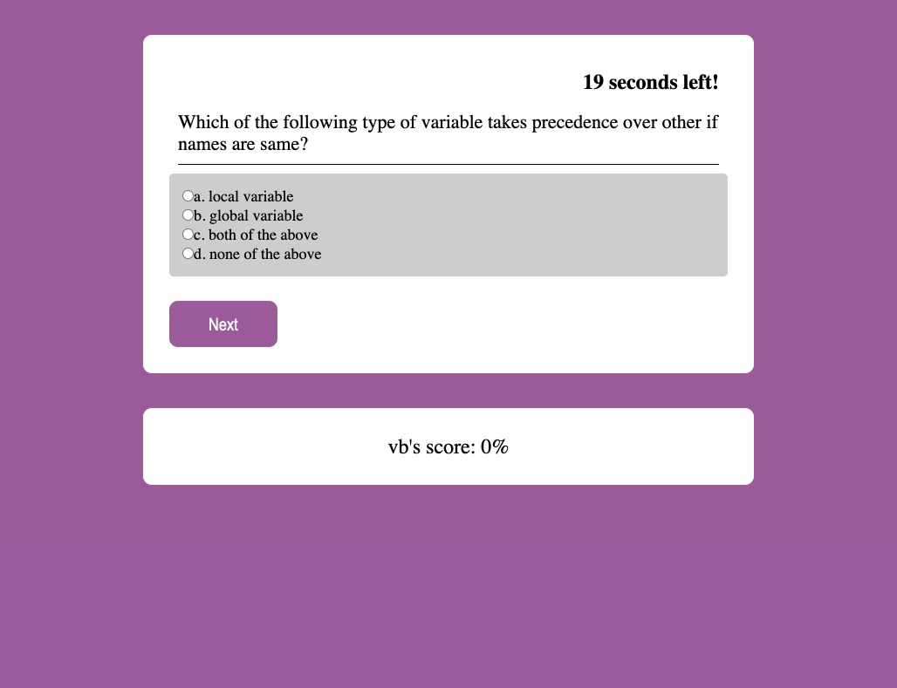

# homework4-CodeQuiz

This is the link to the following assignment: [link](https://valbona1992.github.io/homework4-CodeQuiz/)

## Summary
This assignment required me to implement code to make a timed coding quiz with multiple-choice questions.   

Below is a summary of what I implemented. 

* Implemented a simple HTML file to include basic information for the questionnaire (header, main, sections, divs).
* Implemented css file to style the questionnaire to my own interest. 
* Began the js file by creating selectors to dynamically change HTML file.
* Added five questions in a list of dictionaries to be used for the code. 
* Added a function that starts the quiz, prompts user for initials, shuffles the questions to begin, and begins a timer.
* Added a function to shuffle the questions in an array
* Added a function to submit the answers, and then determine if the answer is correct or not 
* Added a function for a timer to start when the quiz begins, decrements time when a question is lost, and ends the quiz when timer is at 0.
* Added a function to implement when game ends that displays the results and is added to local storage.

## Screenshot
 

